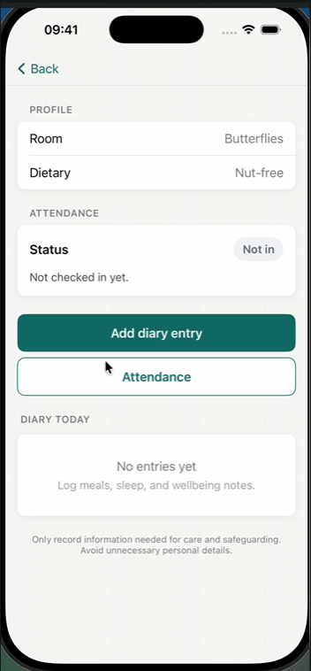
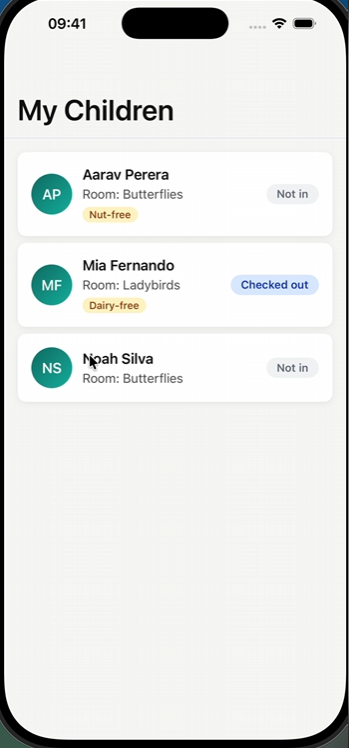
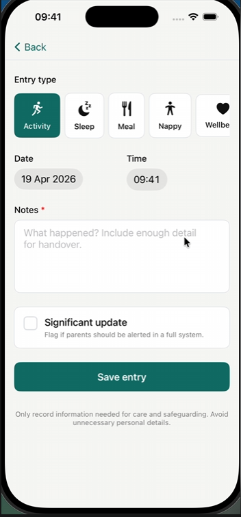
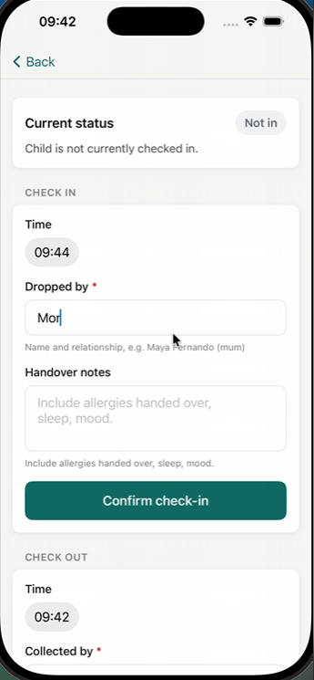
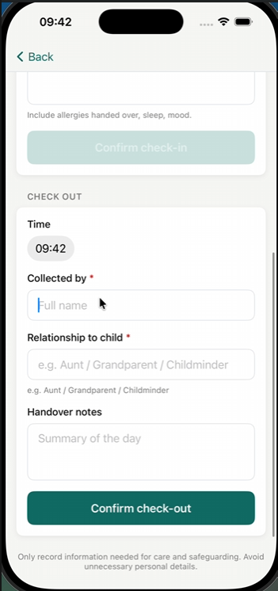

# SE4020 – Mobile Application Design & Development
## Assignment 01 — NurseryConnect iOS MVP

> **Submission Instructions:** Edit this file directly with your report. No separate documentation is required. Commit all your Swift/Xcode project files to this repository alongside this README.

---

## Student Details

| Field | Details |
|---|---|
| **Student ID** | IT22054418 |
| **Student Name** | V.I.Kaluarachchi |
| **Chosen User Role** | Keyworker |
| **Selected Feature 1** | Daily diary and activity monitoring |
| **Selected Feature 2** | Attendance check-in / check-out |

---

## 01. Feature Selection & Role Justification

### Chosen User Role

The **Keyworker** (key person) role is responsible for day-to-day contact with assigned children and families, recording welfare and learning-related observations, and maintaining accurate operational records such as attendance and handover. In the NurseryConnect case study, this role is central to capturing structured information that supports safeguarding, parent partnership, and statutory record-keeping expectations in a UK early-years setting.

### Selected Features

**Feature 1:**

**Daily diary and activity monitoring** — Structured diary entries by type (activity, sleep, meal/fluid, nappy/toilet, wellbeing) with timestamp and free-text notes, shown on a per-child timeline. Supports same-day logging and a professional narrative for parents and internal review.

**Feature 2:**

**Attendance check-in / check-out** — Records check-in and check-out times, who dropped the child off, who collected them, relationship to the child, and optional handover notes (`checkInNotes` / `checkOutNotes`). The child list shows attendance status at a glance (not checked in / checked in / checked out).

### Justification

These two features match Keyworker duties in the case study: they capture **what happened during the day** (diary) and **who was present and responsible at boundaries** (attendance). Together they give a coherent story for a single child on a single day and align with safeguarding and communication priorities without requiring login, backend, or web scope (per assignment constraints). A four-week MVP is realistic because both flows share one navigation pattern (child list → child detail → action), one persistence stack (SwiftData), and one validation approach (central validators + alerts).

---

## 02. App Functionality

### Overview

The app launches directly into **ChildrenListView** (no authentication screen). The Keyworker sees assigned children with room and attendance chips, opens **ChildDetailView** for profile context, dietary flags, diary timeline, and shortcuts to **DiaryEntryFormView** and **AttendanceActionView**. Data persists locally with **SwiftData** so entries survive app relaunch on the simulator or device. Demo children are seeded once when the store is empty (`SeedDataLoader`).

The **NurseryConnectMVP** Xcode project, app sources, and test targets are under [`code/`](code/) (`code/NurseryConnectMVP.xcodeproj`, `code/NurseryConnectMVP/`, `code/NurseryConnectMVPTests/`, `code/NurseryConnectMVPUITests/`). Open the `.xcodeproj` in Xcode on macOS to build and run, as required by the module.

### Screen Descriptions

**Screen 1 — Children list (home)**

The Keyworker sees all assigned children with room labels, dietary pills where applicable, and attendance status chips. Tapping a row navigates to that child’s detail. This screen uses `accessibilityIdentifier` `childrenListScreen` and `childRow` for UI testing.



**Screen 2 — Child detail**

Shows the child’s name, room, dietary flags, current attendance summary, buttons to open diary capture and attendance, and a reverse-chronological diary timeline. This groups everything needed for a quick corridor consultation without tab switching.



**Screen 3 — Add diary entry**

The Keyworker selects an entry type via horizontal chips, enters notes, and saves. Empty notes are rejected with a friendly validation message. Entries appear on the child detail timeline after save.



**Screen 4 — Attendance check-in**

Captures who dropped the child off (required), optional check-in notes, and check-in time. Validation prevents saving without required handover fields.



**Screen 5 — Attendance check-out**

Available once checked in. Requires collector name and relationship (optional notes). Validates that check-out is not before check-in time.



### Navigation

The app uses **`NavigationStack`** from the root list: **ChildrenListView** → **ChildDetailView**; diary and attendance are reached via navigation destinations / buttons from the detail screen (consistent back navigation through the stack). This satisfies the brief’s requirement for at least two screens with navigation between them while keeping the mental model “pick child, then act.”

### Data Persistence

**SwiftData** is used with an explicit `Schema` for `Child`, `DiaryEntry`, and `AttendanceRecord`, configured with `ModelConfiguration(isStoredInMemoryOnly: false)` so records are written to disk. Relaunching the app reloads the same store. There is **no** cloud sync or server in MVP scope. Changing model shape during development may require deleting the app or resetting the simulator if an older store is incompatible (e.g. split `checkInNotes` / `checkOutNotes` on `AttendanceRecord`).

### Error Handling

Validation is centralised in **`DiaryValidator`** and **`AttendanceValidator`**, with errors exposed as `LocalizedError` strings (e.g. diary notes empty; cannot check out before check-in; check-out time earlier than check-in). Views present these with **`Alert`**. Invalid state transitions are blocked before persistence, so the store does not accumulate logically impossible attendance rows.

---

## 03. User Interface Design

### Visual Design

The UI follows a **calm, professional** palette suited to sensitive childcare data: off-white background (`DesignTokens.background`, `#F7F7F5`), strong readable text colours, and a restrained teal primary (`#0F766E`). **Attendance chips** use distinct semantic colours for not checked in, checked in, and checked out so status is readable at a glance. **Dietary** information uses a separate pill style so it is not confused with attendance. Reusable components (`IOSCard`, `IOSButton`, `IOSFormTextField`, `IOSStatusChip`, `IOSNavBar`) keep spacing, corner radius, and button height consistent. Destructive styling is reserved for errors, not normal states, to avoid unnecessary alarm during busy handovers.

### Usability

The flow is **child-first**: pick the child, then diary or attendance. Required fields are obvious; optional notes are secondary. Validation copy is written for staff (“Please enter who collected the child”) rather than developer jargon. Empty states are handled so the Keyworker is never left on a blank screen without explanation.

### UI Components Used

`NavigationStack`, `List`, `ScrollView`, `VStack`, `HStack`, `Form` (where used), `TextField`, `Text`, `Button`, `Alert`, `DatePicker`, `Label`, SF Symbols, custom design-system views (`IOSCard`, `IOSButton`, `IOSFormTextField`, `IOSStatusChip`, `IOSNavBar`), and SwiftData-backed views with `@Query` / `ModelContext` as appropriate in the project sources.

---

## 04. Swift & SwiftUI Knowledge

### Code Quality

The codebase separates **views**, a **view model** (`ChildrenViewModel`), **validators**, **design tokens**, and **SwiftData models** into folders under the app target. Naming follows Swift conventions (`DiaryEntryType`, `AttendanceValidator`). Business rules are not duplicated inside every view; they are invoked before save.

### Code Examples — Best Practices

**Example 1 — Centralised attendance validation (`Validators.swift`)**

Keeping transition rules in one place avoids inconsistent UI behaviour and makes unit testing straightforward.

```swift
enum AttendanceValidator {
    static func validateCheckOut(collectedBy: String, relationship: String, checkInTime: Date?) throws {
        if checkInTime == nil {
            throw ValidationError.invalidTransition("Cannot check out. Child must be checked in first.")
        }
        if collectedBy.trimmingCharacters(in: .whitespacesAndNewlines).isEmpty {
            throw ValidationError.attendanceCollectedByEmpty
        }
        if relationship.trimmingCharacters(in: .whitespacesAndNewlines).isEmpty {
            throw ValidationError.attendanceRelationshipEmpty
        }
    }

    static func validateDateOrder(checkInTime: Date?, checkOutTime: Date?) throws {
        guard let inTime = checkInTime, let outTime = checkOutTime else { return }
        if outTime < inTime {
            throw ValidationError.invalidDate("Check-out time cannot be earlier than check-in time")
        }
    }
}
```

**Example 2 — SwiftData app container (`NurseryConnectMVPApp.swift`)**

The `ModelContainer` is created once at launch with an explicit schema, then injected into the view hierarchy—clear lifecycle and a single source of truth for persistence configuration.

```swift
@main
struct NurseryConnectMVPApp: App {
    let container: ModelContainer

    init() {
        let schema = Schema([Child.self, DiaryEntry.self, AttendanceRecord.self])
        let modelConfiguration = ModelConfiguration(schema: schema, isStoredInMemoryOnly: false)
        do {
            container = try ModelContainer(for: schema, configurations: [modelConfiguration])
        } catch {
            fatalError("Failed to initialize SwiftData container: \(error)")
        }
    }

    var body: some Scene {
        WindowGroup {
            ChildrenListView()
                .modelContainer(container)
                .task { SeedDataLoader.seedIfNeeded(context: container.mainContext) }
        }
    }
}
```

### Advanced Concepts

- **SwiftData** (`@Model`, `ModelContext`, `Schema`, `ModelContainer`) for persistence.
- **Swift Concurrency** via `.task` for one-off seeding on launch.
- **Accessibility** identifiers on key containers for **XCUITest** automation (`childrenListScreen`, `childRow`, `attendanceScreen`).
- **Custom SwiftUI components** encapsulating repeated styling (design system under `Views/DesignSystem/`).

No external networking or third-party SDKs are used in the MVP.

---

## 05. Testing & Debugging

### Testing

The app is covered by **unit tests** for diary and attendance validation and by **UI smoke tests** for launch and navigation into attendance.

**Unit Tests:**

```swift
func testAttendanceValidatorRejectsCheckoutBeforeCheckIn() {
    XCTAssertThrowsError(
        try AttendanceValidator.validateCheckOut(
            collectedBy: "Aunt Maya",
            relationship: "Aunt",
            checkInTime: nil
        )
    ) { error in
        XCTAssertEqual(
            error as? ValidationError,
            .invalidTransition("Cannot check out. Child must be checked in first.")
        )
    }
}
```

**UI Tests:**

`NurseryConnectMVPUITests` launches the app, asserts `childrenListScreen` exists, taps the first `childRow`, taps the **Attendance** button, and asserts `attendanceScreen` appears—guarding the main navigation path.

**Manual Testing:**

- Submit diary with blank notes (expect alert).
- Attempt check-out before check-in (expect transition error).
- Set check-out time earlier than check-in (expect date order error).
- Force-quit and relaunch to confirm SwiftData persistence.

### Debugging

During development, **SwiftData schema changes** (e.g. splitting handover into separate check-in and check-out note fields) caused older simulator stores to fail; resolving this required **resetting the simulator** or deleting the app so a fresh store could be created. UI test failures when SwiftUI accessibility hierarchy changed were fixed by aligning **`accessibilityIdentifier`** values on the SwiftUI side with what XCTest queries.

---

## 06. Regulatory Compliance Report

> This section must demonstrate your understanding of the regulatory requirements relevant to the NurseryConnect system and your chosen role and features.

### Understanding of Regulations

#### UK GDPR

The diary and attendance features process **personal data** about children (identifiers, room, dietary flags, notes) and about adults (names and relationships in free text). In a real deployment, processing must be **lawful, fair, and transparent** (privacy notices, staff training), limited by **purpose** and **data minimisation**, kept **accurate**, retained only as long as justified (**storage limitation**), and secured with appropriate **integrity and confidentiality** measures. Data subjects’ rights (access, rectification, erasure) apply subject to statutory exemptions for safeguarding records. The MVP does not implement consent tooling or retention timers; it only demonstrates field-level minimisation and structured capture.

#### EYFS 2024

The Early Years Foundation Stage expects key persons to contribute to **ongoing assessment** and **strong parent partnership**. Diary entries support **observations and experiences** (activity, wellbeing, sleep, etc.) and same-day communication. Attendance and handover notes support **welfare** and continuity of care. The app does not replace statutory assessment systems; it illustrates structured capture aligned with those duties.

#### Ofsted

Inspectors look for **effective safeguarding**, **well-led** settings, and **clear records**. Structured diary and attendance data would, in a full system, need **traceability** (who created/edited records, when). The MVP shows structured, reviewable timelines on-device only; it does **not** provide multi-user audit logs or export for inspection.

#### Children Act 1989

Safeguarding and the **welfare of the child** are paramount. Recording **who** dropped off and **who** collected, with **relationship**, supports handover accountability. Significant concerns must be escalated through setting procedures in real life—the app captures text but does not implement escalation workflows.

#### FSA Guidelines

Where the diary type **Meal/Fluid** is used, entries can support **consistent dietary care** alongside existing allergen processes in the kitchen. The app does **not** replace **FSA** food safety management systems, allergen risk assessments, or hygiene controls operated by catering staff.

### Compliance by Design

**Architecture:** MVVM-style separation and SwiftData models create clear boundaries so that, in production, **access control and audit** could move to a server without rewriting every view.

**Data handling:** The MVP limits child profile fields; diary types channel input; validators prevent incomplete attendance records that would be weak for safeguarding or accuracy.

**UI:** Required handover fields are prominent; optional notes are secondary; attendance chips reduce mistakes.

**Full production system (not in MVP):** account-based access and **RBAC**; **encryption** in transit and at rest; **audit logging**; **DPIA** and records of processing; **retention/deletion** and **DSAR** tooling; **breach** process; **processor agreements** for cloud services; dedicated **safeguarding escalation** UX separate from routine diary notes.

### Critical Analysis

**Data minimisation vs rich communication:** Rich narratives help parents and inspectors, but excessive unstructured text increases GDPR risk (e.g. special category data). The MVP balances this with **typed diary categories** and one notes field. Production could add prompts, training, and a separate restricted safeguarding module.

**Speed of logging vs mandatory detail:** Too many mandatory fields cause workarounds in busy handovers; too few weaken traceability. The MVP mandates identity fields for attendance boundaries while keeping some notes optional.

**Local-first usability vs central audit:** SwiftData is fast and offline-friendly but a single device lacks enterprise visibility. Production would add **encrypted sync**, authoritative server timestamps, and conflict resolution.

---

## 07. Documentation

### (a) Design Choices

Key decisions: **child-first navigation**; **DesignTokens** + reusable **design system** components for a consistent, calm UI; **semantic attendance chips** and distinct **dietary** styling; **form layouts** that prioritise required safeguarding-adjacent data; **accessibility identifiers** for testing. These choices reflect the **professional childcare context** (sensitive data, time pressure, non-alarming feedback). Further detail is summarised in **§03 User Interface Design**.

### (b) Implementation Decisions

- **Persistence:** SwiftData with `Child`, `DiaryEntry`, `AttendanceRecord`; on-disk store; seed data when empty.
- **Third-party libraries / APIs:** None via SPM; **Apple frameworks only** (SwiftUI, SwiftData, Foundation). No network APIs.
- **MVP simplifications:** No login, no backend, no export, no push notifications, no media pipeline—per assignment and realistic four-week scope.

### (c) Challenges

- **Backend absent vs full case study:** Addressed with local-first models and clear extension points for a future API.
- **Regulatory depth vs time:** Addressed with validators, minimal fields, and honest documentation of production gaps.
- **SwiftData store migration during iteration:** Addressed with documented simulator reset when model fields change.
- **UI test flakiness:** Addressed with stable accessibility identifiers and explicit waits in XCTest.

---

## 08. Reflection

### What went well?

Separating **validators** from views made both **testing** and **UI copy** easier to maintain. The **design system** approach kept the Keyworker screens visually consistent and sped up implementation of diary and attendance forms.

### What would you do differently?

Earlier **test data** and **export** planning would make demo and regulatory discussion easier. Starting **UI tests** alongside the first navigation flow (rather than after feature completion) would have caught accessibility identifier drift sooner.

### AI Tool Usage

As per the submission guidelines, detailed **prompts and responses** for AI-assisted development and report drafting are provided in **[`docs/ai-appendix.md`](docs/ai-appendix.md)**. Replace or supplement with verbatim tool exports if your assessor requires them.

---

*SE4020 — Mobile Application Design & Development | Semester 1, 2026 | SLIIT*

